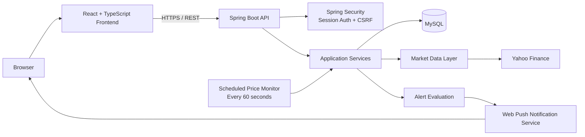
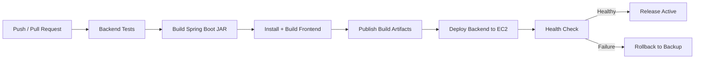

# StockWatch

**A deployed full-stack stock monitoring application built around a Java/Spring Boot backend, a React/TypeScript frontend, scheduled market-data checks, target-price alerts, persistent user sessions, and automated CI/CD.**

[](https://www.oracle.com/java/)
[](https://spring.io/projects/spring-boot)
[](https://react.dev/)
[](https://www.mysql.com/)
[](https://github.com/features/actions)

**Live application:** https://stockwatch.mehedi.dk  
**Backend API:** https://api.stockwatch.mehedi.dk

---

## Why I Built It

StockWatch started from a simple problem: I wanted to follow a small group of stocks without repeatedly checking prices throughout the day.

The project grew into a full-stack engineering exercise covering more than CRUD. It now includes authentication, user-scoped data, external market-data integration, scheduled background processing, browser push notifications, database migrations, frontend/backend integration, deployment automation, health verification, and rollback behavior.

The goal is to build a small application with the same engineering concerns that appear in real backend systems.

---

## What It Does

- Register and sign in with session-based authentication
- Maintain a personal stock watchlist
- Add, edit, view, and delete monitored stocks
- Store buy price, share count, target price, currency, notes, and alert state
- Retrieve current market prices
- Search for stocks through the market-data layer
- View market top gainers
- Check enabled watchlist entries automatically every 60 seconds
- Trigger an alert when the configured target price is reached
- Persist browser push subscriptions and send Web Push notifications
- Persist login sessions in MySQL so application restarts do not automatically invalidate sessions

---

## System Overview



The backend is organized into controller, service, repository, DTO, entity, market-data, scheduler, notification, security/configuration, and exception-handling layers.

---

## Engineering Highlights

### Scheduled monitoring instead of client polling

Price monitoring runs on the backend. A scheduled job loads stocks that are eligible for monitoring, retrieves current market prices, evaluates target conditions, updates alert state, and invokes the notification service when a target is reached.

This keeps alert logic independent from whether the user currently has the frontend open.

### User-scoped REST API

Watchlist operations use the authenticated user's identity. CRUD requests are therefore associated with the logged-in account rather than exposing a shared global stock list.

### Session-based security

The application uses Spring Security with server-side sessions and CSRF protection. Sessions are stored through JDBC/MySQL, allowing authentication state to survive normal application restarts and deployments.

### External market-data boundary

Market data is isolated behind provider/service abstractions rather than being mixed directly into controllers or watchlist persistence logic. The current implementation integrates Yahoo Finance and supports quote retrieval, stock search, and market screening.

### Database migrations

Flyway manages schema changes instead of relying on Hibernate to recreate or mutate the production database automatically.

### Web Push notifications

The notification layer stores browser push subscriptions and uses VAPID credentials to deliver target-price alerts through Web Push.

---

## Technology Stack

### Backend

- Java 21
- Spring Boot 4.x
- Spring Web MVC
- Spring Data JPA / Hibernate
- Spring Security
- Spring Session JDBC
- Jakarta Bean Validation
- Flyway
- Gradle with Kotlin DSL

### Data

- MySQL
- Flyway migrations

### Frontend

- React 19
- TypeScript
- Vite
- React Router

### Integration & Notifications

- Yahoo Finance market data
- Web Push / VAPID

### Delivery & Operations

- GitHub Actions
- AWS EC2 backend deployment
- systemd service management
- Build artifacts for backend and frontend
- Deployment health verification
- Backup/rollback path for failed backend releases

---

## CI/CD Pipeline

The repository contains a GitHub Actions workflow that runs for pushes and pull requests.



For production backend deployment, the workflow uploads the new JAR to EC2, stops the existing systemd service, keeps a backup of the previous artifact, installs the new release, restarts the service, and verifies the deployment through an application endpoint before considering it healthy.

The pipeline turns deployment into a repeatable engineering process instead of a manual copy-and-restart procedure.

---

## REST API Overview

### Authentication

| Method | Endpoint | Purpose |
|---|---|---|
| `GET` | `/api/auth/csrf` | Obtain CSRF token |
| `POST` | `/api/auth/register` | Register a user |
| `POST` | `/api/auth/login` | Authenticate and create session |
| `GET` | `/api/auth/me` | Return authenticated user |

### Watchlist

| Method | Endpoint | Purpose |
|---|---|---|
| `POST` | `/api/stocks` | Add a stock |
| `GET` | `/api/stocks` | List authenticated user's stocks |
| `GET` | `/api/stocks/{id}` | Get one stock |
| `PUT` | `/api/stocks/{id}` | Update a stock |
| `DELETE` | `/api/stocks/{id}` | Delete a stock |
| `GET` | `/api/stocks/{id}/price` | Retrieve current market price |

### Market Data

| Method | Endpoint | Purpose |
|---|---|---|
| `GET` | `/api/market/search?q={query}` | Search supported stocks |
| `GET` | `/api/market/top-gainers` | Retrieve top market gainers |

The application also exposes endpoints used to configure and persist browser push subscriptions.

---

## Project Structure

```text
StockWatch/
├── .github/
│   └── workflows/
│       └── ci-cd.yml
├── frontend/                  React + TypeScript frontend
├── src/
│   ├── main/
│   │   ├── java/mehedi/stockwatch/
│   │   │   ├── config/       Security and application configuration
│   │   │   ├── controller/   Authentication and watchlist REST API
│   │   │   ├── dto/          API request/response models
│   │   │   ├── entity/       Persistence entities
│   │   │   ├── exception/    Error handling
│   │   │   ├── market/       Quotes, search, screening and provider integration
│   │   │   ├── notification/ Web Push and subscription handling
│   │   │   ├── repository/   Data-access layer
│   │   │   ├── scheduler/    Background price monitoring
│   │   │   └── service/      Application/business logic
│   │   └── resources/
│   │       ├── db/            Flyway migrations
│   │       └── application.properties
│   └── test/
├── build.gradle.kts
└── settings.gradle.kts
```

---

## Running Locally

### Prerequisites

- Java 21
- MySQL
- Node.js and npm

### 1. Clone the repository

```bash
git clone https://github.com/Mehedihasan2026/StockWatch.git
cd StockWatch
```

### 2. Configure backend environment variables

The backend expects database, frontend-origin, and Web Push configuration through environment variables.

```text
DB_HOST=localhost
DB_PORT=3306
DB_NAME=stockwatch
DB_USERNAME=your_mysql_user
DB_PASSWORD=your_mysql_password

FRONTEND_ORIGIN=http://localhost:5173

VAPID_PUBLIC_KEY=your_public_key
VAPID_PRIVATE_KEY=your_private_key
VAPID_SUBJECT=mailto:your-email@example.com
```

Do not commit real database passwords or VAPID private keys to the repository.

### 3. Run the backend

```bash
./gradlew bootRun
```

The backend runs on:

```text
http://localhost:8081
```

### 4. Run the frontend

```bash
cd frontend
npm ci
npm run dev
```

The local frontend is normally available at:

```text
http://localhost:5173
```

---

## Design Decisions

A few choices in this project are intentional:

- **Backend-owned monitoring:** alerts should work even when the browser is closed.
- **Provider abstraction:** market-data integration should be replaceable without rewriting watchlist business logic.
- **DTOs at the API boundary:** persistence entities are not used as the public REST contract.
- **Flyway migrations:** database evolution is explicit and reproducible.
- **Persistent sessions:** authentication state is not tied only to one application process lifecycle.
- **Automated deployment checks:** a successful build is not treated as a successful release until the deployed service responds correctly.

---

## Current Direction

StockWatch is an active portfolio project. Areas I want to continue improving include automated test coverage, observability, richer market insights, notification controls, and deployment resilience.

The project is intentionally being developed incrementally: first establishing a clean backend/domain model, then integrating market data, authentication, frontend functionality, notifications, and production delivery practices.

---

## Author

**Md Mehedi Hasan**  
Java / Spring Boot Backend & Software Engineer  
Aarhus, Denmark

Portfolio: https://mehedi.dk  
LinkedIn: https://linkedin.com/in/bemehedi
